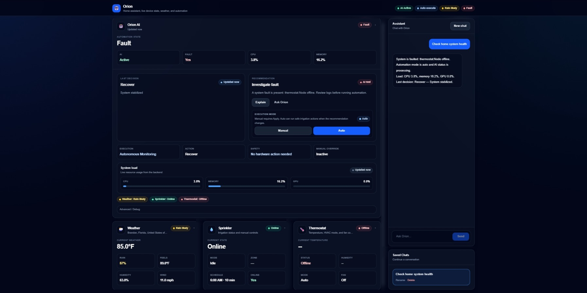
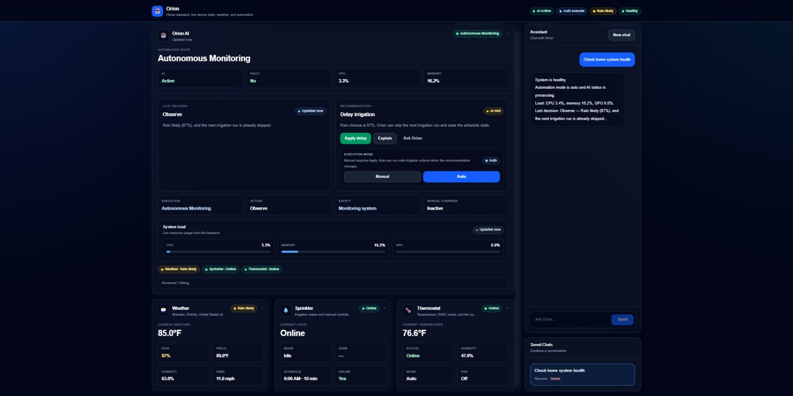

# Orion V2 — Distributed Edge Automation Platform

Orion V2 is a distributed edge automation platform that combines full-stack software, embedded systems, real-time telemetry, and AI-assisted operational monitoring into a unified control system for real HVAC and irrigation hardware.

The platform runs on NVIDIA Jetson edge hardware and communicates with Raspberry Pi field controllers and ESP32 edge nodes using MQTT-based distributed messaging.

Unlike a simulated dashboard project, Orion monitors and controls physical hardware in real time.

---

# Quick Overview

Orion V2 demonstrates:

* Distributed system architecture
* Full-stack application development
* Real-time telemetry and monitoring
* MQTT-based device communication
* Raspberry Pi field-controller integration
* ESP32 embedded firmware integration
* HVAC and irrigation automation
* Fault detection and operational visibility
* AI-assisted operational recommendations
* NVIDIA Jetson edge deployment
* Safety-focused control logic and fail-safe behavior

---

# System Architecture

```txt
┌──────────────────────────────────────────────┐
│              NVIDIA Jetson                   │
│   React Dashboard + Flask API + AI Layer     │
└──────────────────────┬───────────────────────┘
                       │
                REST / MQTT
                       │
┌──────────────────────▼───────────────────────┐
│       Raspberry Pi Field Controllers         │
│    HVAC Service + Irrigation Service         │
└──────────────────────┬───────────────────────┘
                       │
                     MQTT
                       │
┌──────────────────────▼───────────────────────┐
│               ESP32 Edge Nodes               │
│      Relays + Sensors + Heartbeats           │
└──────────────────────────────────────────────┘
```

---

# Recruiter Summary

Orion V2 is a portfolio project demonstrating software engineering, distributed systems design, embedded systems integration, telemetry pipelines, REST API development, edge-device deployment, and operational monitoring.

The system uses a React dashboard, Python Flask backend, Raspberry Pi field controllers, and ESP32 relay nodes to monitor and control real HVAC and irrigation hardware.

Key engineering focus areas include:

* Distributed device coordination
* Fault-aware monitoring
* Hardware safety logic
* Real-time telemetry
* Embedded device communication
* Edge-device deployment
* AI-assisted operational recommendations
* System reliability and fail-safe behavior

---

# Core Features

## Real-Time Monitoring Dashboard

Orion provides a live operational dashboard displaying:

* HVAC state
* Irrigation scheduling
* Weather conditions
* Device health
* System telemetry
* CPU / memory / GPU utilization
* AI recommendations
* Fault state visibility
* Controller and node status

---

## Distributed Device Communication

The platform uses MQTT messaging between:

* NVIDIA Jetson application server
* Raspberry Pi field controllers
* ESP32 edge nodes

This allows Orion to distribute control logic, telemetry, and hardware state across multiple independent devices.

---

## HVAC Automation

The HVAC controller supports:

* Live temperature and humidity telemetry
* Auto / cool / heat / off modes
* Fan auto / on / off modes
* Compressor protection logic
* Minimum equipment on/off timers
* Changeover lockout handling
* Relay feedback monitoring
* Active alarm visibility
* Fault reporting

A major reliability improvement separates commanded HVAC state from relay feedback so stale node data cannot incorrectly re-command equipment.

---

## Irrigation Automation

The irrigation controller supports:

* Multi-zone sprinkler scheduling
* Manual zone control
* Live irrigation timeline
* Weather-aware skip logic
* Schedule synchronization
* Safe stop commands
* Raspberry Pi local schedule ownership
* ESP32 relay-node integration

The irrigation controller can continue operating independently on the Raspberry Pi even if the central Orion dashboard becomes unavailable.

---

## Fault Detection and System Visibility

Orion includes fault-aware monitoring for distributed field devices.

The platform can:

* Detect offline devices
* Surface node-level faults
* Report relay mismatches
* Display controller health state
* Preserve visibility during partial system failures
* Support safer troubleshooting and recovery

The system is designed to fail safely, report problems clearly, and maintain operational visibility instead of silently hiding failures.

---

## AI-Assisted Operational Recommendations

Orion includes an AI-assisted monitoring layer capable of evaluating live system state and generating operational recommendations.

Example behaviors include:

* Delaying irrigation when rain is likely
* Monitoring system health
* Explaining current device state
* Summarizing telemetry
* Recommending operator actions

Automation can run in manual approval mode or auto-execute mode depending on safety settings.

---

# Screenshots

## AI-Assisted Monitoring


Orion evaluates live telemetry, weather conditions, and device state to provide operational recommendations.

---

## Live Telemetry Dashboard


The dashboard displays live HVAC state, irrigation scheduling, device telemetry, and distributed system health.

---

## Healthy Distributed System State



The dashboard displays healthy controller and node communication across the distributed platform.

---

## Distributed Fault Detection



For validation, a thermostat field controller was intentionally powered down to confirm Orion detected the offline device, surfaced the fault condition, and preserved visibility into the remaining system state.

---

# Reliability and Safety Design

Orion is designed around predictable hardware behavior and operational reliability.

Key reliability concepts include:

* Field-controller independence
* Local controller ownership of hardware logic
* Distributed architecture
* Runtime state persistence
* Fault visibility
* Compressor lockout protection
* Minimum equipment on/off timers
* Fan post-run handling
* Relay feedback monitoring
* Manual override capability
* Safe stop commands
* Weather-aware irrigation protection
* Fail-safe controller operation

The Raspberry Pi field controllers continue operating locally even if the Jetson application layer becomes unavailable.

This prevents the dashboard or AI orchestration layer from becoming a single point of failure.

---

# Technology Stack

## Backend

* Python
* Flask
* REST APIs
* MQTT
* Local AI integration
* Runtime state management

---

## Frontend

* React
* Next.js
* TypeScript
* Real-time telemetry polling
* Component-based UI architecture

---

## Hardware and Infrastructure

* NVIDIA Jetson
* Raspberry Pi 4
* ESP32
* Linux
* systemd services
* MQTT messaging
* Relay-control hardware
* HVAC equipment integration
* Irrigation hardware integration
---
# Where Orion V2 Can Grow

Orion V2 is currently focused on HVAC and irrigation control, but the architecture is designed to expand into a broader edge automation platform.

The same distributed pattern — NVIDIA Jetson application layer, Raspberry Pi field controllers, ESP32 edge nodes, MQTT messaging, real-time telemetry, fault tracking, and AI-assisted operational recommendations — can support additional real-world systems such as:

* Environmental monitoring
* Lighting control
* Pump and motor systems
* Energy management
* Security and sensor networks
* Distributed equipment supervision
* Predictive maintenance workflows
* Remote edge-device coordination

The long-term goal is to evolve Orion into a scalable edge AI and industrial IoT platform capable of monitoring, coordinating, and automating multiple physical systems from a unified operational dashboard.

The platform is intentionally modular so additional field controllers, edge nodes, telemetry pipelines, and automation services can be integrated without redesigning the overall system architecture.
---

# Repository Structure

```txt
server/
├── backend/
└── frontend/

field-controller/
├── hvac-controller/
└── irrigation-controller/

firmware/
├── esp32-hvac-node/
└── esp32-irrigation-node/

docs/
├── screenshots/

examples/
scripts/
```

---

# Running Locally

## Backend

```bash
cd server/backend
python -m venv .venv
source .venv/bin/activate
pip install -r requirements.txt
python app.py
```

Backend:

```txt
http://127.0.0.1:5001
```

---

## Frontend

```bash
cd server/frontend
npm install
npm run dev
```

Frontend:

```txt
http://localhost:3000
```

---

# Field Controllers

The field controllers are designed to run independently on Raspberry Pi hardware using systemd-managed services.

Example controller folders:

```txt
field-controller/hvac-controller/
field-controller/irrigation-controller/
```

Each field controller owns:

* Local runtime state
* Hardware-facing logic
* Scheduling
* Safety protections
* MQTT communication
* Relay coordination
* Fault reporting
* Fail-safe behavior

This architecture keeps hardware execution close to the equipment while Orion provides centralized monitoring and operational visibility.

---

# What This Project Demonstrates

Orion V2 demonstrates practical engineering experience across:

* Full-stack software development
* Embedded systems integration
* Distributed systems communication
* REST API design
* Real-time telemetry pipelines
* Operational monitoring
* Hardware relay control
* MQTT messaging
* Edge-device deployment
* Raspberry Pi services
* ESP32 firmware integration
* HVAC automation
* Irrigation automation
* Fault detection and troubleshooting
* Reliability-focused system design
* AI-assisted operational tooling

---

# Project Status

Orion V2 is an actively developed distributed edge automation platform focused on:

* Real-world hardware integration
* Operational reliability
* Distributed telemetry
* Embedded systems communication
* Edge-device deployment
* Modular architecture
* Fault-aware monitoring
* AI-assisted operational workflows

The project is currently maintained as a portfolio platform demonstrating full-stack, embedded, IoT, and control-system engineering.
