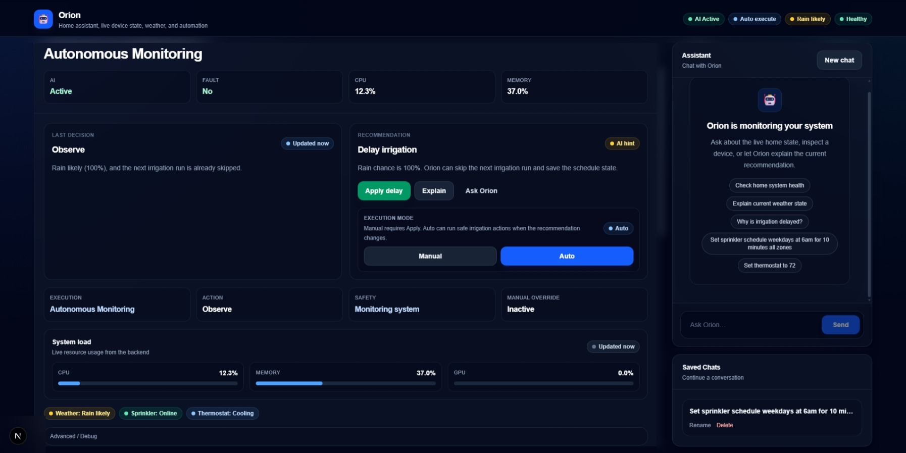
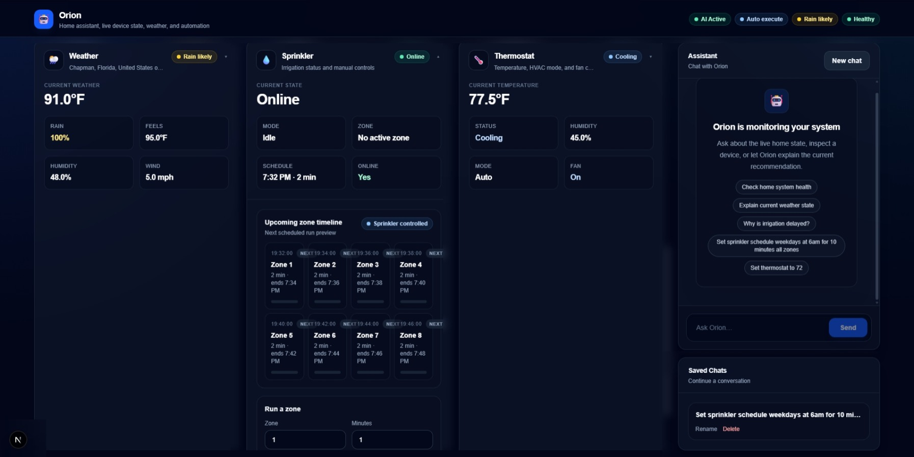

# Orion V2 — Distributed IoT Control Platform

Full-stack IoT automation platform for real-time HVAC and irrigation control using Python, React, Raspberry Pi, ESP32, MQTT, and REST APIs.

Orion V2 connects a local application server, Raspberry Pi field controllers, and ESP32 edge nodes to monitor live device state, execute hardware commands, synchronize schedules, track faults, and support AI-assisted automation decisions.

Unlike a simulated dashboard, Orion controls and monitors real hardware.

---

## Screenshots

### AI-Assisted Automation



Orion monitors live system state and provides automation recommendations based on weather, device status, and safety rules.

### Live Device Dashboard



The dashboard displays real-time weather, irrigation scheduling, HVAC state, telemetry, and device health from the distributed system.

---

## What This Project Demonstrates

Orion V2 demonstrates real-world software and control-system engineering across:

- Full-stack application development
- Backend API design
- Real-time telemetry
- Distributed device coordination
- Hardware relay control
- MQTT messaging
- Raspberry Pi field services
- ESP32 edge-node integration
- HVAC safety logic
- Irrigation scheduling
- Fault detection and monitoring
- AI-assisted automation
- System reliability and debugging

---

## Architecture

Orion V2 is split into three major layers.

```txt
┌──────────────────────────────────────┐
│          Application Server           │
│  React Dashboard + Flask API + AI     │
└───────────────────┬──────────────────┘
                    │
          REST / MQTT / Telemetry
                    │
┌───────────────────▼──────────────────┐
│        Raspberry Pi Field Controllers │
│   HVAC Service + Irrigation Service   │
└───────────────────┬──────────────────┘
                    │
                 MQTT
                    │
┌───────────────────▼──────────────────┐
│             ESP32 Edge Nodes          │
│     Relays + Sensors + Heartbeats     │
└──────────────────────────────────────┘
```

---

## Application Server

The application server hosts the main Orion platform.

It includes:

- React / Next.js dashboard
- Python Flask backend
- REST API endpoints
- AI orchestration layer
- Session and memory handling
- Global system state
- Device status aggregation
- Weather-aware automation logic

The dashboard provides a live view of system health, device state, automation recommendations, and manual controls.

---

## Field Controller Layer

The Raspberry Pi field controllers handle local hardware-facing services.

Current field controllers include:

- HVAC controller
- Irrigation controller

These services are responsible for:

- Local runtime state
- Hardware safety logic
- MQTT communication
- Schedule execution
- Relay command coordination
- Fault reporting
- Fail-safe behavior
- systemd service operation

---

## Field Controller Independence

HVAC and irrigation controllers are designed to run independently on the Raspberry Pi.

Orion provides centralized monitoring, AI-assisted recommendations, and operator control, but each field controller maintains its own local runtime state, scheduling, safety logic, and fail-safe behavior if the central application server is unavailable.

This separation keeps hardware execution close to the equipment and prevents the dashboard or AI layer from becoming a single point of failure.

---

## Edge Hardware Layer

ESP32 nodes provide distributed edge control.

ESP32 responsibilities include:

- Relay control
- Sensor monitoring
- Heartbeat publishing
- Local device feedback
- Hardware state reporting
- MQTT communication with the Raspberry Pi controller

---

## Core Features

### Real-Time Dashboard

Orion provides a live dashboard for:

- Weather conditions
- HVAC state
- Irrigation schedule
- System health
- CPU / memory / GPU monitoring
- Automation mode
- AI recommendations
- Saved assistant sessions

### HVAC Control

The HVAC controller supports:

- Live temperature and humidity telemetry
- Auto / cool / heat / off modes
- Fan auto / on / off modes
- Compressor protection
- Minimum on/off timers
- Changeover lockout
- Fan post-run
- Relay feedback monitoring
- Active alarms and health state

A key reliability improvement separates commanded HVAC state from relay feedback so stale ESP32 feedback cannot incorrectly re-command cooling or heating.

### Irrigation Control

The irrigation controller supports:

- Multi-zone sprinkler scheduling
- Manual zone control
- Live zone timeline
- Safe stop commands
- Schedule synchronization
- Weather-aware skip logic
- Raspberry Pi controller ownership
- ESP32 relay-node integration

Orion can sync weekday schedules, start times, zone durations, and next-run timelines to the Raspberry Pi irrigation controller.

The irrigation controller can also run independently on the Raspberry Pi, preserving local schedule execution and manual control even without the central Orion dashboard.

### AI-Assisted Automation

Orion includes an AI-assisted automation layer that can evaluate live system state and recommend actions.

Examples:

- Delay irrigation when rain is likely
- Monitor HVAC state
- Explain current system behavior
- Summarize live device status
- Provide operator-facing recommendations

Automation can run in manual approval mode or auto-execute mode depending on safety settings.

---

## Reliability Improvements

Recent reliability work included:

- Refactored the project into a clean portfolio repository
- Fixed real sprinkler schedule synchronization between Orion and the Raspberry Pi controller
- Added safer HVAC state handling so relay feedback cannot incorrectly re-command equipment
- Improved frontend rendering for richer live device data
- Fixed irrigation timeline zone numbering
- Verified live telemetry, hardware state, and schedule execution through the dashboard
- Preserved field-controller independence so local Pi services can continue operating without Orion

---

## Technology Stack

### Backend

- Python
- Flask
- REST APIs
- MQTT
- Local AI integration
- Runtime state management

### Frontend

- React
- Next.js
- TypeScript
- Real-time dashboard polling
- Component-based UI structure

### Hardware / Infrastructure

- Raspberry Pi 4
- ESP32
- MQTT messaging
- Linux
- systemd services
- Relay control systems
- HVAC and irrigation hardware

---

## Repository Structure

```txt
server/
├── backend/
└── frontend/

field-controller/
├── hvac-controller/
└── irrigation-controller/

firmware/
├── esp32-hvac-node/
└── esp32-irrigation-node/

docs/
├── screenshots/

examples/
scripts/
```

---

## Running Locally

### Backend

```bash
cd server/backend
python -m venv .venv
.venv/Scripts/activate
pip install -r requirements.txt
python app.py
```

The backend runs on:

```txt
http://127.0.0.1:5001
```

### Frontend

```bash
cd server/frontend
npm install
npm run dev
```

The frontend runs on:

```txt
http://localhost:3000
```

---

## Field Controllers

The field controllers are designed to run on a Raspberry Pi using systemd services.

Example controller folders:

```txt
field-controller/hvac-controller/
field-controller/irrigation-controller/
```

Each controller owns its local hardware-facing logic and communicates with Orion through HTTP and MQTT.

---

## Safety and Reliability Notes

Orion is designed around predictable hardware behavior, not just UI interaction.

Safety-focused design decisions include:

- Local controller execution on the Raspberry Pi
- Separate orchestration and field-control layers
- Compressor lockout protection
- Minimum equipment on/off timers
- Fan post-run handling
- Relay feedback monitoring
- Fault state reporting
- Manual override capability
- Safe stop commands
- Runtime state persistence
- Weather-aware irrigation skip logic

---

## Project Status

Orion V2 is an actively developed distributed control platform focused on real-world automation reliability, modular system design, and scalable edge-device integration.

The project is currently used as a portfolio system demonstrating full-stack, embedded, IoT, and control-system engineering.