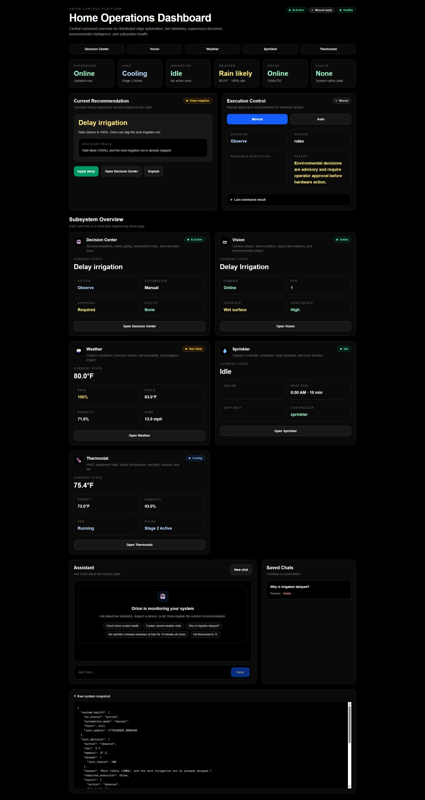
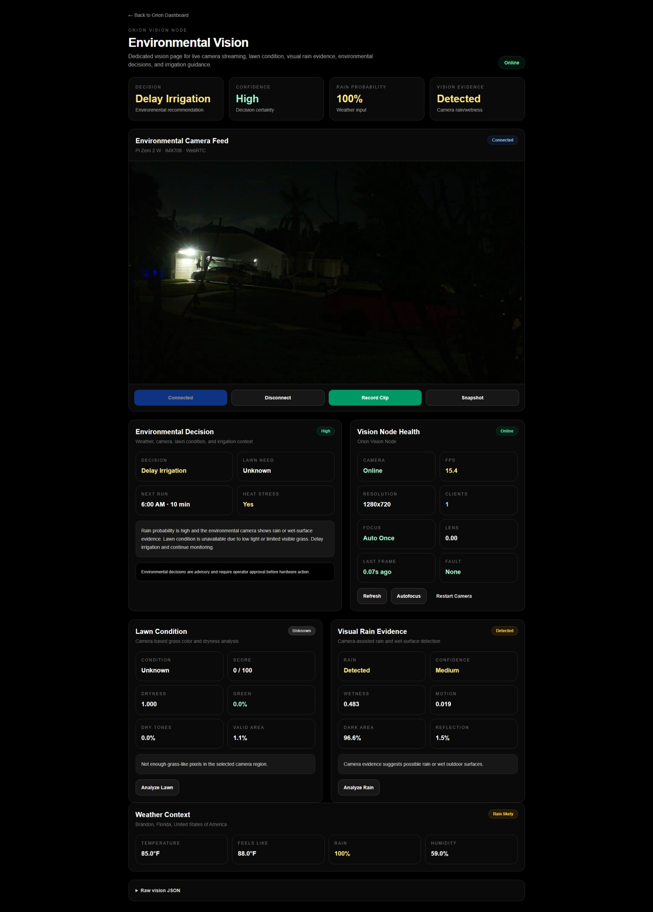
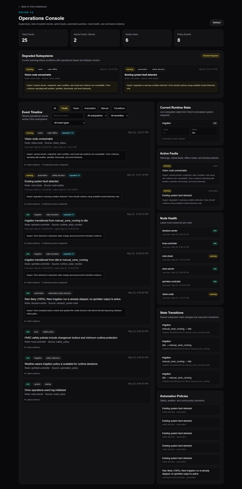
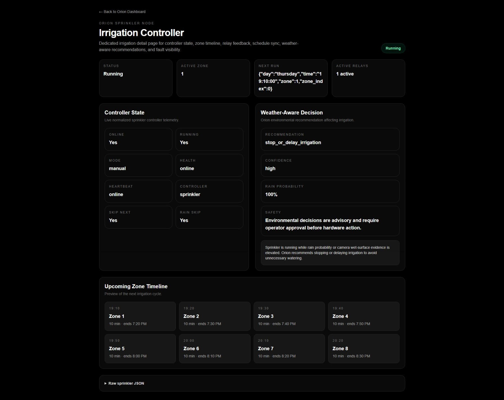
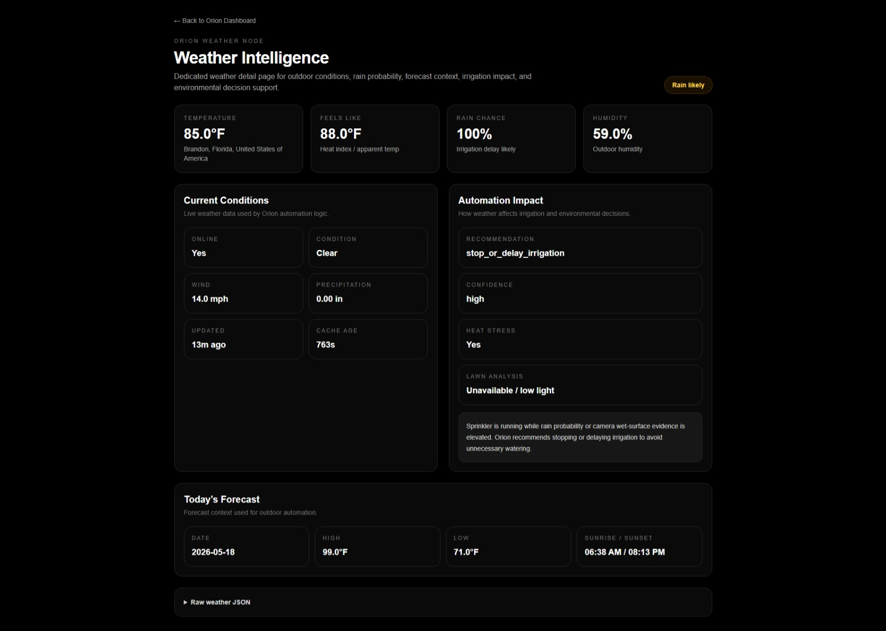
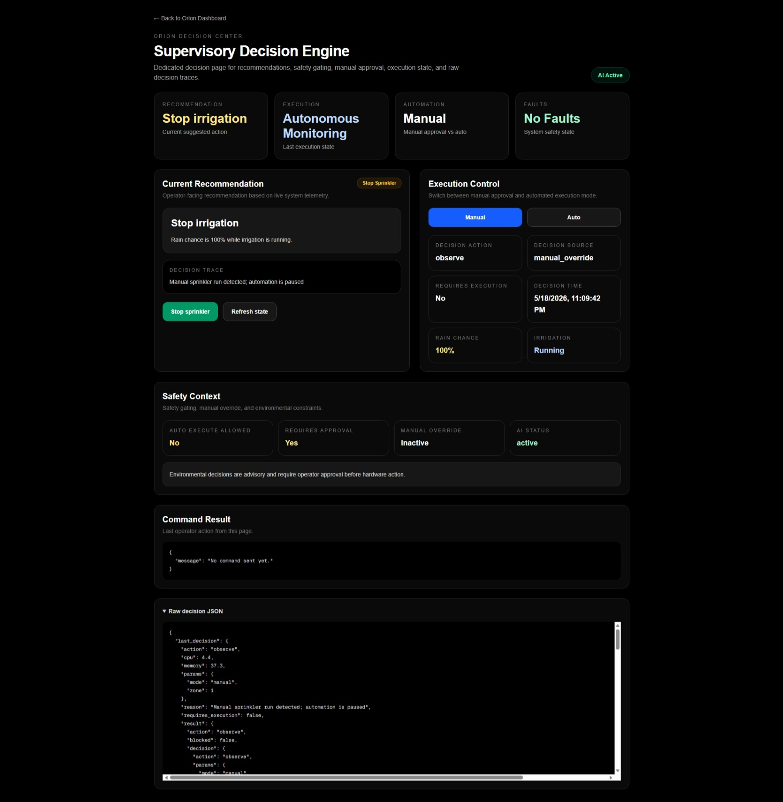
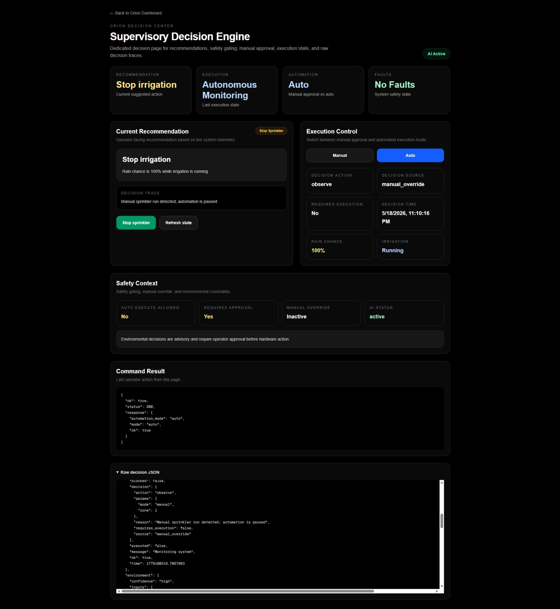

# Orion V2 — Distributed Edge Automation Platform


Orion V2 is a local-first supervisory automation platform for real HVAC, irrigation, thermostat, weather, environmental vision, and distributed edge-control systems.

It runs on NVIDIA Jetson edge hardware using Docker Compose and integrates Raspberry Pi field controllers, ESP32 relay nodes, MQTT telemetry, Flask APIs, a Next.js operations dashboard, WebRTC video, deterministic safety logic, event history, and AI-assisted operational recommendations.

This is not a simulated dashboard. Orion supervises real distributed hardware, normalizes telemetry, exposes degraded subsystem state, records command and decision history, tracks state transitions, and routes hardware actions through safe operator-approved control paths.

---

## Project Summary

Orion demonstrates a full-stack edge automation system built around real equipment behavior instead of mock data. The platform separates field-controller responsibility from supervisory orchestration: local controllers own hardware execution and safety timing, while Orion provides centralized visibility, decision support, fault awareness, event history, and operator control.

Core engineering themes:

- distributed system supervision
- hardware-adjacent backend APIs
- real-time telemetry normalization
- degraded-state handling
- safety-aware command routing
- event and fault visibility
- edge deployment on Linux / NVIDIA Jetson
- full-stack operational UI design

---

## At a Glance

| Area | Implementation |
|---|---|
| Edge host | NVIDIA Jetson running Docker Compose |
| Frontend | Next.js, React, TypeScript |
| Backend | Python Flask API |
| Messaging | Mosquitto MQTT |
| Field controllers | Raspberry Pi HVAC and irrigation controllers |
| Edge nodes | ESP32 relay / telemetry nodes |
| Vision node | Raspberry Pi Zero 2 W, IMX708 camera, WebRTC stream |
| Vision interpretation | Jetson-side lawn, rain / wet-surface, and low-light analysis |
| AI layer | Local LLM-assisted monitoring and recommendations |
| Control model | Deterministic safety logic with operator-approved execution |
| Operations layer | Event timeline, active faults, audit trail, and state transitions |

---

## Table of Contents

- [Project Summary](#project-summary)
- [Purpose](#purpose)
- [Highlights](#highlights)
- [Screenshots](#screenshots)
- [What Orion Demonstrates](#what-orion-demonstrates)
- [System Architecture](#system-architecture)
- [Dashboard Structure](#dashboard-structure)
- [Integrated Subsystems](#integrated-subsystems)
- [AI-Assisted Monitoring](#ai-assisted-monitoring)
- [Operations Console](#operations-console)
- [Degraded Subsystem Handling](#degraded-subsystem-handling)
- [Supervisory Orchestration Focus](#supervisory-orchestration-focus)
- [Quick Start](#quick-start)
- [Docker Deployment](#docker-deployment)
- [API Examples](#api-examples)
- [Event Model](#event-model)
- [Technology Stack](#technology-stack)
- [Field Controller Independence](#field-controller-independence)
- [Reliability and Safety Design](#reliability-and-safety-design)
- [Running Locally](#running-locally)
- [Environment Variables](#environment-variables)
- [Quality Gates](#quality-gates)
- [Repository Structure](#repository-structure)
- [Security Notes](#security-notes)
- [Safety Notes](#safety-notes)
- [Current Status](#current-status)
- [Project Relevance](#project-relevance)
- [Author](#author)
- [Licensing](#licensing)


## Purpose

Orion V2 was built to explore how a local edge platform can supervise distributed automation systems while keeping field controllers independent, visible, and safe.

Instead of replacing device-level logic, Orion acts as a supervisory orchestration layer above HVAC, irrigation, thermostat, weather, and environmental vision subsystems.

The goal is to demonstrate a complete edge automation platform, not a simple relay dashboard.

Orion is designed around one central idea: real automation systems need more than commands. They need state visibility, fault awareness, safe execution paths, operational history, state transitions, command audit trails, and clear reasoning about why an action should or should not happen.

---

## Highlights

### Platform

- NVIDIA Jetson edge deployment
- Docker Compose orchestration
- Next.js / React / TypeScript dashboard
- Python Flask backend API
- Mosquitto MQTT broker
- Local-first LAN architecture

### Field Systems

- Raspberry Pi HVAC and irrigation controllers
- ESP32 relay / telemetry nodes
- Thermostat state normalization
- Sprinkler scheduling, manual control, and weather-aware skip logic
- Environmental vision node with IMX708 camera and WebRTC streaming

### Operations and Reliability

- Operations Console for events, faults, node health, and command evidence
- Degraded subsystem visibility
- Compacted repeated-event timeline
- Manual command audit events
- Automation policy decision events
- Irrigation state transition history
- Controller acknowledgement normalization
- Optional hardware-control token gate
- Single-process threaded backend deployment for predictable local runtime state

### Decision Support

- Environmental decision engine
- Rain / wet-surface evidence handling
- Low-light visual-analysis safeguards
- Local LLM-assisted monitoring and recommendations
- Manual and automatic execution modes with deterministic safety checks

---

## Screenshots

### Main Operations Dashboard



Clean command overview for system health, recommendations, subsystem status, automation mode, and assistant interaction.

### Environmental Vision Node



Live environmental camera stream with camera health, lawn condition, visual rain evidence, weather context, and irrigation impact.

### Operations Console — Degraded Subsystem Handling



Operations view showing degraded subsystem state, active faults, compacted repeated events, node health, operational impact messages, and continued operation with trusted telemetry.

### Irrigation Controller



Live irrigation state, active zone status, relay activity, schedule context, and weather-aware recommendations.

### Weather Intelligence



Outdoor conditions, rain probability, forecast context, and automation impact.

### Supervisory Decision Center



Current recommendation, decision trace, safety gating, automation mode, command result, and raw decision state.

### Thermostat / HVAC Node



Normalized HVAC state from the RPi4 / ESP32 controller, including setpoint, cooling state, fan state, humidity, event history, and command logging.

---

## What Orion Demonstrates

Orion demonstrates engineering across multiple layers:

- full-stack application development
- backend API design
- distributed system architecture
- Dockerized edge deployment
- MQTT-based device communication
- REST API integration
- WebRTC stream integration
- browser-side media recording
- embedded hardware integration
- Raspberry Pi field-controller design
- ESP32 relay-node integration
- HVAC automation
- irrigation automation
- environmental camera monitoring
- deterministic visual analysis
- weather-aware decision logic
- AI-assisted recommendation workflows
- fault detection and operational visibility
- safety-aware hardware control

The goal is to demonstrate a complete edge automation platform, not a simple relay dashboard.

---

## System Architecture

```txt
┌────────────────────────────────────────────────────────────┐
│                 NVIDIA Jetson Edge Server                  │
│                                                            │
│  Docker Compose                                            │
│  ├── Next.js Frontend                                      │
│  ├── Flask Backend API                                     │
│  ├── Mosquitto MQTT Broker                                 │
│  ├── Thermostat Bridge                                     │
│  ├── Environmental Decision Engine                         │
│  └── AI-Assisted Monitoring Loop                           │
└───────────────────────────┬────────────────────────────────┘
                            │
                  REST / MQTT / WebRTC
                            │
┌───────────────────────────▼────────────────────────────────┐
│              Raspberry Pi Field Controllers                │
│                                                            │
│  ├── HVAC Controller Service                               │
│  ├── Irrigation Controller Service                         │
│  └── Local Runtime State + Safety Logic                    │
└───────────────────────────┬────────────────────────────────┘
                            │
                           MQTT
                            │
┌───────────────────────────▼────────────────────────────────┐
│                    ESP32 Edge Nodes                        │
│                                                            │
│  Relays + Sensors + Heartbeats + Feedback                  │
└───────────────────────────┬────────────────────────────────┘
                            │
┌───────────────────────────▼────────────────────────────────┐
│                    Real Equipment                          │
│                                                            │
│  HVAC Equipment + Irrigation Hardware                      │
└────────────────────────────────────────────────────────────┘
```

Environmental vision runs as a separate subsystem:

```txt
┌────────────────────────────────────────────────────────────┐
│              Raspberry Pi Zero 2 W Vision Node             │
│                                                            │
│  ├── IMX708 Camera                                         │
│  ├── Picamera2                                             │
│  ├── WebRTC Stream Service                                 │
│  ├── Snapshot Endpoint                                     │
│  ├── Autofocus Control                                     │
│  └── Camera Health / Status API                            │
└───────────────────────────┬────────────────────────────────┘
                            │
                   REST / WebRTC Integration
                            │
┌───────────────────────────▼────────────────────────────────┐
│                    Orion / Jetson Platform                 │
│                                                            │
│  Displays live environmental video and evaluates vision     │
│  context such as lawn condition, rain / wet-surface         │
│  evidence, and low-light analysis availability.             │
└────────────────────────────────────────────────────────────┘
```

---

## Dashboard Structure

Orion separates the main command dashboard from detailed subsystem views.

```txt
/
├── /decision-center
├── /operations
├── /vision
├── /weather
├── /sprinkler
└── /thermostat
```

The main dashboard provides a high-level operational overview. Each subsystem page provides deeper engineering visibility. The Operations Console provides event history, active faults, command audit records, policy decisions, and state transitions.

### Main Dashboard

The dashboard shows:

- overall system health
- AI status
- automation mode
- current recommendation
- execution controls
- subsystem summaries
- Operations Console entry point
- assistant interface
- saved chats
- raw system snapshot

### Decision Center

The Decision Center shows:

- current recommendation
- action source
- decision trace
- safety context
- manual vs automatic execution mode
- command result
- raw decision JSON

Decision Center recommendations are recorded into the Operations event history when they represent meaningful policy decisions, safety decisions, manual override pauses, or recommended actions.

### Operations Console

The Operations Console shows:

- event timeline
- degraded subsystem panel
- active faults
- node health
- automation policy decisions
- manual command audit events
- state transition history
- execution evidence
- controller acknowledgements
- operational impact messages
- compacted repeated events
- quick filters for faults, vision, automation, manual commands, and transitions

Example Operations events:

```txt
Vision node unreachable
Manual run zone 6 for 1 minute(s)
Manual sprinkler stop
irrigation transitioned from idle to manual_zone_running
irrigation transitioned from manual_zone_running to idle
Rain likely (100%). Next irrigation run is already skipped; no sprinkler output is active.
```

### Vision Node

The Vision page shows:

- live WebRTC camera feed
- stream status
- camera health
- FPS and resolution
- focus state
- lens position
- frame freshness
- Jetson-side lawn condition interpretation
- Jetson-side rain / wet-surface evidence evaluation
- Low-light / dark-condition handling
- weather context
- environmental recommendation

### Sprinkler Node

The Sprinkler page shows:

- irrigation status
- active zone
- next scheduled run
- relay activity
- controller health
- schedule state
- weather-aware decision
- upcoming zone timeline
- raw controller JSON

### Weather Intelligence

The Weather page shows:

- outdoor temperature
- feels-like temperature
- humidity
- rain probability
- wind speed
- forecast context
- automation impact
- environmental reasoning

### Thermostat Node

The Thermostat page shows:

- room temperature
- target setpoint
- humidity
- equipment state
- cooling / heating / fan activity
- HVAC mode
- fan mode
- event history
- command logging

---

## Integrated Subsystems

### HVAC / Thermostat Node

The HVAC controller provides:

- live temperature telemetry
- humidity telemetry
- setpoint state
- cooling / heating state
- fan state
- relay feedback
- safety timing logic
- heartbeat monitoring
- fault visibility

The thermostat detail page normalizes HVAC state into a first-class Orion subsystem. Today it reads from the RPi4 / ESP32 HVAC controller. The same normalized model can support future Honeywell / Resideo thermostat integration.

### Irrigation Node

The irrigation controller provides:

- multi-zone scheduling
- manual zone control
- active run status
- relay state
- local schedule ownership
- weather-aware skip logic
- heartbeat monitoring
- fault visibility

The sprinkler detail page displays zone timelines, relay activity, schedule state, controller status, and weather-aware recommendations.

The Operations Console records irrigation command audit events and state transitions, for example:

```txt
Manual run zone 6 for 1 minute(s)
irrigation transitioned from idle to manual_zone_running
Manual sprinkler stop
irrigation transitioned from manual_zone_running to idle
```

### Environmental Vision Node

The Vision subsystem provides:

- live environmental video from the Raspberry Pi Zero 2 W camera node
- WebRTC streaming
- browser recording
- snapshot capture
- autofocus control
- frame freshness telemetry
- camera health status
- fault state
- Jetson-side lawn condition interpretation
- Jetson-side rain / wet-surface evidence evaluation
- low-light handling so unreliable visual readings are not treated as valid lawn data

When the vision node is unreachable, Orion records a structured `node_offline` event into the Operations Console.

### Environmental Decision Engine

The environmental decision engine combines:

- weather conditions
- rain probability
- camera rain evidence
- visual lawn condition
- dryness index
- sprinkler runtime state
- next scheduled irrigation
- low-light analysis availability

Example recommendation:

```txt
Delay irrigation
```

Example reason:

```txt
Rain probability is high and the environmental camera shows rain or wet-surface evidence.
Delay irrigation and continue monitoring lawn condition.
```

The decision engine is deterministic and advisory. Hardware action requires approval unless explicitly configured for safe automatic execution.

---

## AI-Assisted Monitoring

Orion includes an AI-assisted monitoring layer that can inspect live system state and explain recommendations.

The AI layer can:

- summarize current system health
- explain why irrigation is delayed
- inspect live device telemetry
- describe active faults
- answer dashboard questions
- support structured recommendations

The AI does not bypass deterministic safety logic. Hardware actions are routed through the control layer.

---

## Degraded Subsystem Handling

Orion is designed to keep operating when a subsystem becomes unavailable.

When the environmental vision node is offline, Orion does not treat missing camera data as valid visual evidence. The Vision page enters a degraded mode and clearly marks camera-derived information as unavailable.

In degraded vision mode:

- camera stream is unavailable
- snapshots are unavailable
- lawn analysis is unavailable
- visual rain and wet-surface evidence are unavailable
- weather and controller telemetry remain active
- environmental recommendations continue using trusted available inputs
- unavailable sensor data is not treated as valid evidence

The Operations Console surfaces degraded subsystem state as first-class operational information. Repeated events such as `Vision node unreachable` are compacted into a single timeline card with repeat count, first-seen time, latest-seen time, latest evidence, and operational impact.

Example compacted Operations timeline entry:

- Event: Vision node unreachable
- Repeat count: x11
- First seen: May 22, 9:53 PM
- Latest: May 23, 1:42 PM
- Impact: camera stream, snapshots, lawn condition, and visual rain evidence are unavailable.
- Fallback: Orion continues operating with weather, sprinkler, thermostat, and event telemetry.

This keeps the timeline readable while preserving the operational history and evidence trail.

---

## Supervisory Orchestration Focus

Orion is designed as a supervisory orchestration layer, not a monolithic replacement for every controller.

Field controllers remain responsible for local device behavior, safety timing, and hardware execution. Orion provides centralized visibility, normalized telemetry, recommendations, command routing, fault awareness, and operator control.

This architecture allows Orion to supervise multiple device types and protocols over time:

- existing Raspberry Pi controllers
- ESP32 relay nodes
- thermostat integrations
- MQTT devices
- REST-connected services
- future RS485 / Modbus devices
- environmental camera nodes

The important design goal is normalization: different hardware backends can feed one consistent Orion model.

---

## Quick Start

For a Jetson-based deployment:

```bash
git clone <repository-url>
cd orion-v2
docker compose up -d --build
```

Then open:

```txt
http://<JETSON-IP>:3001
```

Check service status:

```bash
docker compose ps
```

View logs:

```bash
docker compose logs -f
```

For local development, see [Running Locally](#running-locally).

---

## Docker Deployment

Orion runs as a Docker Compose stack on the Jetson.

Current services:

```txt
orion-frontend   Next.js dashboard
orion-backend    Flask API, monitoring loop, control routing, vision proxy, and thermostat normalization
orion-mqtt       Mosquitto MQTT broker
```

Thermostat normalization currently runs through the backend/runtime integration layer rather than a separate Docker Compose service.

### Runtime State Note

The backend is intentionally deployed as a single Gunicorn process because Orion's live runtime state, background monitoring loop, and in-memory device snapshot are process-local. Gunicorn threads are used within that single process so slow hardware, vision, or event requests cannot block unrelated health and dashboard routes. Future production hardening should move runtime state to a persistent shared store such as SQLite before increasing backend process count.

Start the stack:

```bash
docker compose up -d --build
```

Check status:

```bash
docker compose ps
```

View logs:

```bash
docker compose logs -f
```

Default ports:

```txt
Frontend: http://<JETSON-IP>:3001
Backend:  http://<JETSON-IP>:5001
MQTT:     <JETSON-IP>:1883
```

The included `docker-compose.yml` reflects the author's local Jetson deployment. For another network, update the vision-node, controller, and service URLs to match the target environment before running the stack.

---

## API Examples

### System State

```txt
GET /v1/system
```

### Operations

Operations API endpoints:

- `GET /v1/events` — raw Operations event history
- `GET /v1/events?compact=true` — compacted timeline events with repeat counts, first-seen time, latest-seen time, and latest evidence
- `GET /v1/faults` — current degraded subsystem and active fault state
- `GET /v1/faults?include_recovered=true` — fault summary including recovered faults
- `GET /v1/events?subsystem=irrigation` — events filtered by subsystem
- `GET /v1/events?severity=warning` — events filtered by severity
- `GET /v1/events?event_type=state_transition` — events filtered by event type

Example fault summary fields:

- `key`
- `subsystem`
- `node`
- `status`
- `severity`
- `event_type`
- `message`
- `first_seen`
- `last_seen`
- `repeat_count`
- `recovered_at`
- `impact`

The Operations Console uses `/v1/faults` for degraded subsystem and active fault state, and `/v1/events?compact=true` for the compacted event timeline.

### Vision

```txt
GET  /v1/vision/status
GET  /v1/vision/snapshot
GET  /v1/vision/grass-condition
GET  /v1/vision/rain-detection
POST /v1/vision/focus
POST /v1/vision/restart-camera
POST /v1/vision/offer
```

### Thermostats

```txt
GET  /v1/thermostats
GET  /v1/thermostats/{id}
POST /v1/thermostats/ingest
POST /v1/thermostats/{id}/setpoint
GET  /v1/thermostats/events
```

### Control

```txt
POST /v1/control/sprinkler/zone
POST /v1/control/sprinkler/stop
POST /v1/control/sprinkler/program-now
POST /v1/control/sprinkler/skip
POST /v1/control/sprinkler/clear-skip
GET  /v1/control/sprinkler/schedule
POST /v1/control/sprinkler/schedule
POST /v1/control/thermostat/setpoint
POST /v1/control/thermostat/mode
POST /v1/control/thermostat/fan
GET  /v1/control/ai/recommendation
POST /v1/control/ai/mode
POST /v1/control/ai/execute
POST /v1/control/ai/apply
```

### Assistant / Sessions

```txt
GET  /v1/sessions
GET  /v1/session/{id}
POST /v1/chat/stream
```

---

## Event Model

Operations events are stored as structured JSON objects.

Example:

```json
{
  "id": "evt_example",
  "timestamp": 1779495873.735326,
  "subsystem": "irrigation",
  "node": "sprinkler-controller",
  "severity": "info",
  "event_type": "manual_zone_start",
  "message": "Manual run zone 6 for 1 minute(s)",
  "source": "manual_control",
  "evidence": {
    "zone": 6,
    "minutes": 1,
    "command": "start_zone",
    "result": {
      "ok": true,
      "normalized_status": "accepted_redirect",
      "controller_acknowledged": true
    }
  }
}
```

State transition example:

```json
{
  "event_type": "state_transition",
  "message": "irrigation transitioned from idle to manual_zone_running",
  "evidence": {
    "from_state": "idle",
    "to_state": "manual_zone_running",
    "reason": "Manual run zone 6 for 1 minute(s)",
    "zone": 6,
    "minutes": 1
  }
}
```

---

## Example System Payload

```json
{
  "ai_status": "active",
  "automation_mode": "manual",
  "fault": null,
  "weather": {
    "online": true,
    "temp": 85.0,
    "rain_chance": 100
  },
  "sprinkler": {
    "online": true,
    "running": false,
    "next_run": "6:00 AM · 10 min"
  },
  "thermostat": {
    "online": true,
    "temperature": 75.4,
    "setpoint": 72,
    "cooling": true,
    "fan": true
  },
  "environment": {
    "recommendation": "delay_irrigation",
    "confidence": "high",
    "reason": "Rain probability is high. Delay irrigation and continue monitoring."
  }
}
```

---

## Technology Stack

### Frontend

- Next.js
- React
- TypeScript
- WebRTC viewer
- subsystem detail pages
- Operations Console
- live polling
- assistant interface

### Backend

- Python
- Flask
- REST APIs
- MQTT integration
- system state aggregation
- device control routing
- vision proxy routes
- thermostat normalization
- environmental decision engine
- operations event store
- state transition logging
- command audit logging

### Infrastructure

- NVIDIA Jetson
- Docker
- Docker Compose
- Mosquitto MQTT
- Linux
- local network deployment

### Hardware

- Raspberry Pi 4 field controllers
- Raspberry Pi Zero 2 W vision node
- IMX708 camera
- ESP32 relay nodes
- HVAC equipment
- irrigation equipment

### AI / Automation

- local LLM support
- Ollama integration
- deterministic safety logic
- AI-assisted explanations
- structured recommendations
- manual / automatic execution modes
- decision audit events

---

## Field Controller Independence

HVAC and irrigation controllers are designed to run independently on Raspberry Pi hardware.

Orion provides centralized monitoring, AI-assisted recommendations, and operator control, but each field controller maintains its own local runtime state, scheduling, safety logic, and fail-safe behavior if the central Jetson application server is unavailable.

This separation keeps hardware execution close to the equipment and prevents the dashboard or AI layer from becoming a single point of failure.

---

## Reliability and Safety Design

Orion is designed around predictable hardware behavior and operational reliability.

Key reliability concepts include:

- field-controller independence
- local controller ownership of hardware logic
- Dockerized application services
- systemd-managed field services
- runtime state persistence
- fault visibility
- degraded subsystem visibility
- operations event history
- compacted repeated event timeline
- command audit trail
- state transition history
- stale telemetry detection
- camera-node reachability checks
- visual condition telemetry
- low-light analysis handling
- compressor lockout protection
- minimum equipment on/off timers
- fan post-run handling
- relay feedback monitoring
- manual override capability
- safe stop commands
- weather-aware irrigation protection
- expected controller acknowledgement normalization

Important safety goals include:

- do not blindly assume hardware commands succeed
- expose active faults clearly
- expose degraded subsystem state clearly
- separate recommendation from execution
- avoid running automation when hardware is unavailable
- avoid treating unavailable sensor data as valid evidence
- detect offline field nodes
- show last decision and recommendation
- provide manual override behavior
- avoid unsafe automation when device state is unknown
- avoid treating low-light visual analysis as reliable lawn data
- preserve execution evidence for hardware commands

Orion is an educational engineering project and is not a certified commercial control system.

---

## Running Locally

### Backend

```bash
cd server/backend
python -m venv .venv
source .venv/bin/activate
pip install -r requirements.txt
python app.py
```

Backend:

```txt
http://127.0.0.1:5001
```

### Frontend

```bash
cd server/frontend
npm install
npm run dev
```

Frontend:

```txt
http://localhost:3000
```

---

## Environment Variables

Example environment variables:

```txt
NEXT_PUBLIC_BACKEND_URL=http://<JETSON-IP>:5001
OLLAMA_BASE_URL=http://127.0.0.1:11434
OLLAMA_MODEL=mistral
WEATHER_LOCATION=Brandon,FL
MQTT_HOST=localhost
MQTT_PORT=1883
VISION_NODE_URL=http://192.168.7.218:5000
VISION_NODE_FALLBACK_URL=http://100.69.25.43:5000
VISION_TIMEOUT=5.0
ORION_THERMOSTAT_SYNC_INTERVAL_SECONDS=10
ORION_EVENT_LOG_PATH=/tmp/orion_events.jsonl
SPRINKLER_BASE_URL=http://192.168.7.232:5000
SPRINKLER_ZONE_OFFSET=-1
```

Actual values may vary depending on local, Docker, Jetson, or field-controller deployment.

---

## Quality Gates

Orion includes a basic GitHub Actions workflow for repository health checks.

Current CI checks:

- frontend dependency install
- frontend lint check
- frontend production build
- backend dependency install
- backend Flask app import smoke check
- backend route-map smoke check

The backend CI job runs with startup disabled so hardware polling, local LLM warmup, and field-controller integrations are not required for repository validation.

---

## Repository Structure

```txt
server/
├── backend/
│   ├── api/
│   ├── ai/
│   ├── core/
│   ├── routes/
│   ├── tools/
│   ├── app.py
│   ├── thermostat_service.py
│   └── thermostat_bridge.py
└── frontend/
    └── app/
        ├── page.tsx
        ├── decision-center/
        ├── operations/
        ├── sprinkler/
        ├── thermostat/
        ├── thermostats/
        ├── vision/
        └── weather/

docs/
├── screenshots/

docker-compose.yml
docker-compose.override.yml
```

---

## Security Notes

The current deployment is intended for local network / development use.

Important security considerations before exposing Orion outside a private LAN:

- do not expose MQTT publicly without authentication
- do not expose the vision node publicly
- do not port-forward the dashboard or backend without access control
- add dashboard authentication before remote access
- add MQTT username/password and ACLs
- use HTTPS / reverse proxy for external access
- keep hardware control endpoints protected
- keep camera endpoints protected
- avoid running on public Wi-Fi without additional security hardening

Orion is currently designed as a local-first edge automation system.

---

## Safety Notes

This project interacts with real electrical, HVAC, irrigation, and camera hardware.

Important safety considerations:

- understand wiring before connecting relays
- use proper relay isolation
- verify voltage levels
- avoid unsafe HVAC short-cycling
- provide manual shutoff methods
- test with disconnected loads first
- do not rely only on software for emergency shutoff
- follow safe electrical practices
- use camera hardware responsibly
- use at your own risk

Orion is an educational engineering project, not a certified commercial control system.

---

## Current Status

Working features:

- Docker Compose deployment on NVIDIA Jetson
- containerized frontend, backend, MQTT broker, and thermostat bridge
- clean main operations dashboard
- dedicated subsystem detail pages
- Operations Console
- Operations degraded subsystem panel
- Operations quick filters
- Operations repeated-event compaction
- `/v1/events` event API
- structured event timeline
- active fault visibility
- active fault deduplication
- node health view
- manual command audit events
- automation policy decision events
- irrigation state transition history
- controller acknowledgement normalization
- assistant interface
- saved chat/session support
- live system metrics
- AI-assisted recommendation display
- environmental decision engine
- operations event store
- state transition logging
- command audit logging
- manual and automatic execution mode display
- HVAC integration support
- thermostat state normalization
- sprinkler integration support
- environmental vision node integration
- vision degraded-mode handling
- unavailable camera evidence handling
- embedded WebRTC camera stream
- browser recording for vision stream
- snapshot support
- autofocus control
- visual lawn condition analysis
- visual rain / wet-surface evidence detection
- low-light lawn analysis handling
- weather-aware irrigation logic
- fault state display
- Raspberry Pi field-controller integration
- Raspberry Pi Zero 2 W camera-node integration
- ESP32 node integration support
- local LLM support
- Jetson edge deployment support
- distributed MQTT messaging

Planned improvements:

- unified device registry
- persistent event storage volume
- fault correlation across subsystems
- controller heartbeat dashboard
- improved lawn-region targeting and calibration
- watering restriction awareness
- irrigation verification from environmental snapshots
- RS485 / Modbus adapter support
- additional thermostat adapters
- automated recovery workflows
- production Docker hardening
- persistent Docker volumes
- MQTT authentication
- dashboard authentication
- reverse proxy / HTTPS
- public demo video
- hardware simulation mode

---

## Project Relevance

Orion V2 demonstrates the ability to build a complete connected system across multiple layers of software, hardware, networking, and controls engineering.

This project is especially relevant to roles involving:

- IoT engineering
- Edge AI systems
- Backend API development
- Full-stack development
- Embedded systems integration
- Automation and controls engineering
- Hardware-adjacent software development
- Distributed telemetry systems
- Computer vision infrastructure

Orion V2 demonstrates:

- frontend dashboard
- backend API
- AI-assisted automation
- WebRTC video integration
- visual analysis
- environmental decision logic
- Raspberry Pi field controllers
- Raspberry Pi Zero camera node
- ESP32 hardware nodes
- MQTT communication
- Docker Compose deployment
- device telemetry
- relay control
- persistent state
- fault handling
- degraded subsystem handling
- compacted operations timeline
- event timeline
- command audit trail
- state transition history
- operations console
- safety-aware decision logic
- local edge deployment
- supervisory orchestration

This makes the project relevant to full-stack development, IoT engineering, embedded systems, automation, edge AI, backend API development, computer vision infrastructure, and control-system integration.

---

## Author

David Echols  
GitHub: Echo13091

Built as a distributed edge automation project combining AI-assisted software, NVIDIA Jetson edge compute, Docker Compose deployment, Raspberry Pi field controllers, Raspberry Pi Zero 2 W environmental vision, ESP32 hardware nodes, and real home automation equipment.

---

## Licensing

All rights reserved.

This repository is provided for portfolio and educational viewing purposes only.

No permission is granted to copy, redistribute, modify, deploy, or commercially use Orion V2 without explicit written permission from the author.